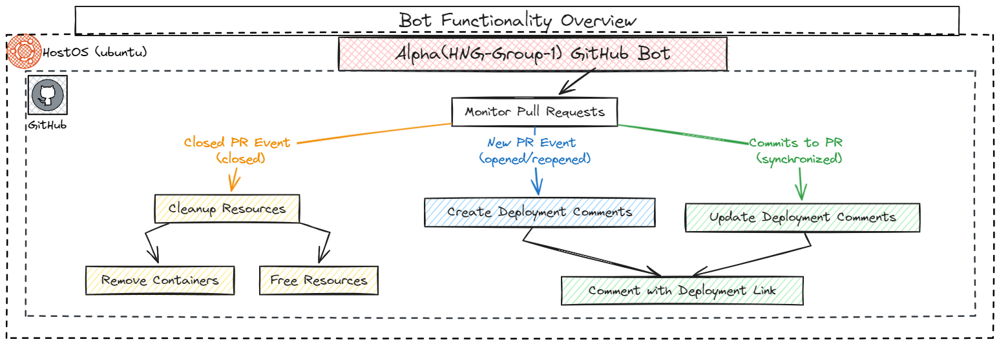
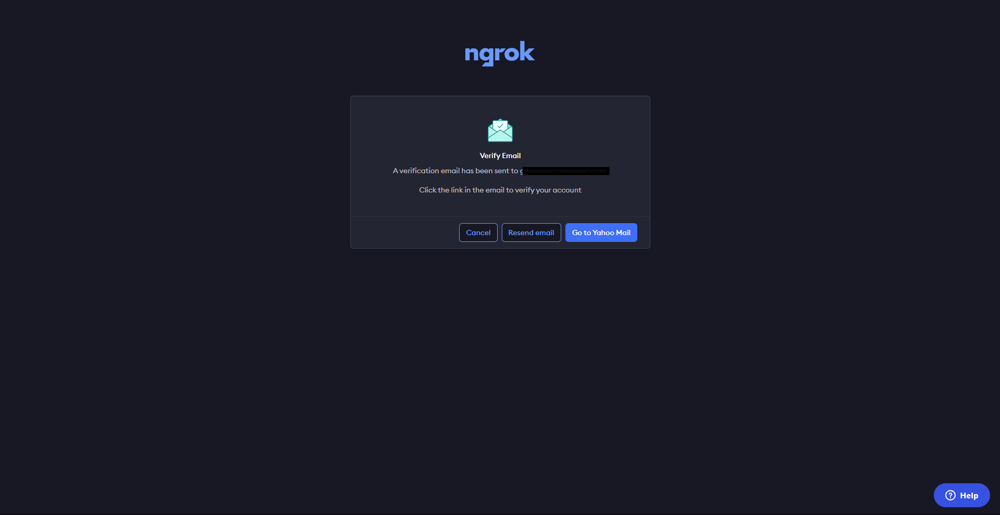
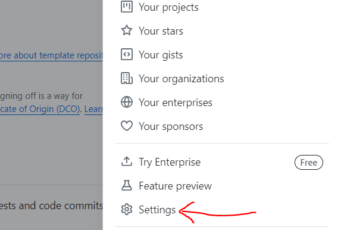
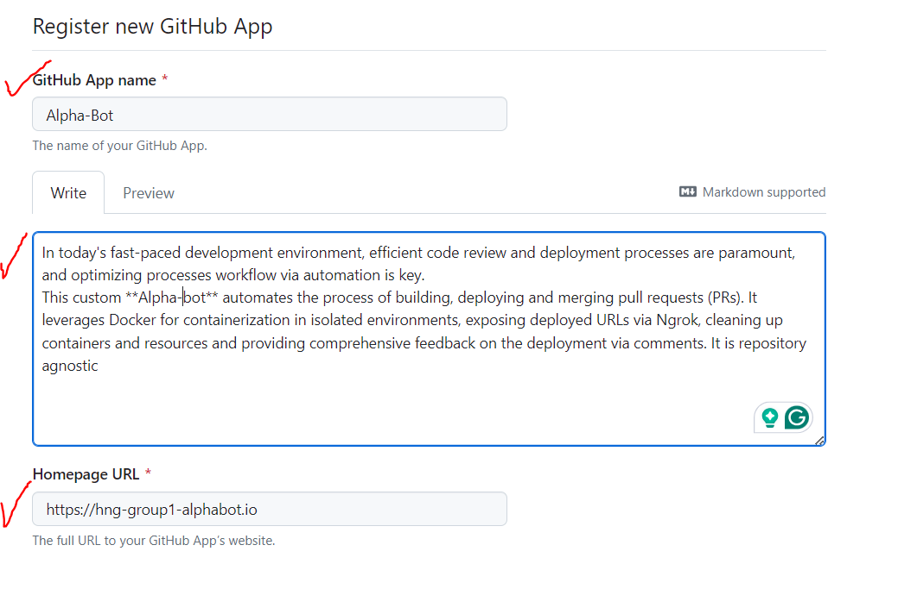
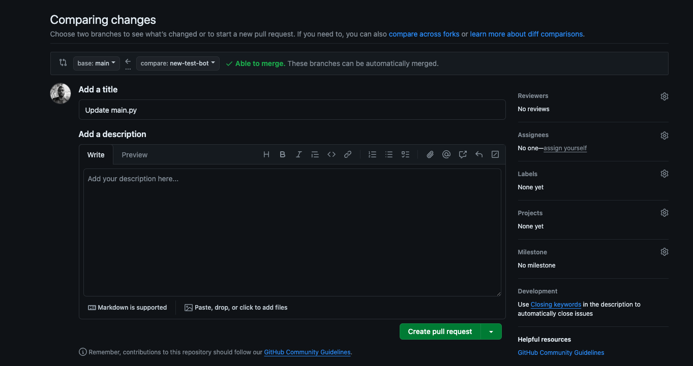
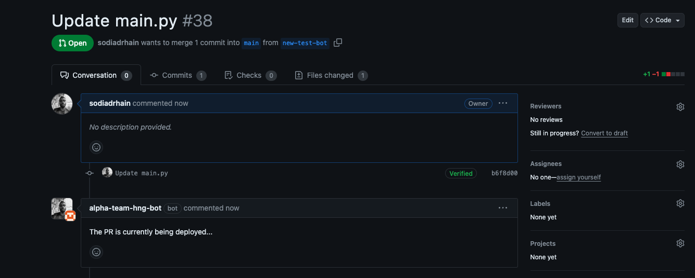
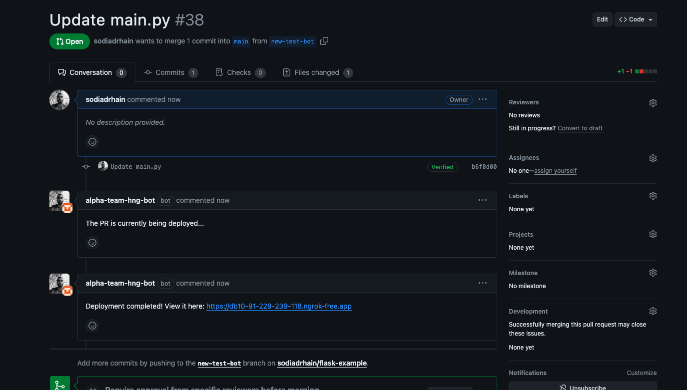
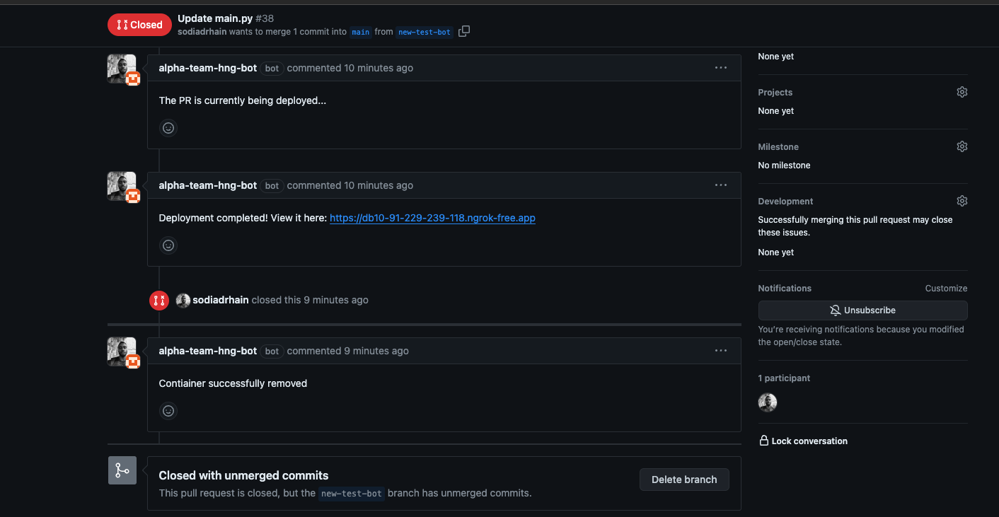

# HNG-DevOps-1(Alpha Bot) Documentation

## Overview

When it comes to software development a robust CI/CD (Continuous Integration/Continuous Deployment) system is a mustt, its inexcusable.

One such CI/CD system you could have in place is this custom **Alpha bot**, a `Node.js` application. The bot automates building, deploying and merging pull requests (PRs)—every pull request automatically get its own testing environment, isolated from the main codebase.

It uses **Docker** for containerization in isolated environments, exposing deployed URL via **ngrok**, clean up of containers and resources and provides comprehensive feedback on the deployment via comments. It is repository agnostic.

This would mean new features and bug fixes are evaluated in a production-like setting before merging, which can be game-changing.

Such a setup offers an:

- **Effortless Testing of New Features**: Automatically deploy each new pull request into its Docker container, providing a pristine environment that mirrors production.
- **Enhanced Code Review Process**: Enable reviewers to interact with live, deployed versions of the code changes, facilitating thorough testing and validation.
- **Optimized Resource Management System**: Automate the cleanup of Docker containers upon pull request closure, ensuring optimal use of infrastructure without manual intervention.

<a id="toc"></a>

## Table of Contents

- [Architecture](#architecture)
- [Folder Structure](#folder-structure)
- [Prerequisites](#prerequisites)
- [Getting Started](#getting-started)
  - [Section A: Setting Up the Alpha-Bot](#section-a)
  - [Section B](#section-b)
- [Troubleshooting and Best Practices](#troubleshooting)
- [Project Contributors](#contributors)

<a id="architecture"></a>

## Architecture


The bot listens for pull request events (`opened`, `reopened`, `synchronize`, `closed`) and performs the following actions:

- **Opened/Reopened/Synchronize**: Triggers a deployment of the pull request code using Docker and adds a comment to the pull request.
- **Closed**: Removes the deployed Docker container and its associated resources, and adds a comment to the pull request

<a id="folder-structure"></a>

## Folder Structure

```
|--- services
|    |--- deploymentService.js
|    |--- repositoryService.js
|--- .gitignore
|--- index.js
|--- package.json
|--- README.md
```

- services/deploymentService.js: Handles Docker deployment operations
- services/repositoryService.js: Manages interactions with the GitHub API
- index.js: The main application file that sets up the server and handles incoming webhook events.

<a id="prerequisites"></a>

## Prerequisites to Get Started

Before diving into the setup, let's ensure you have all the necessary tools and knowledge to make this journey smooth and successful. However, we are making a couple assumptions, that you:

1. Understand Docker and have used it for deployment purposes
2. Understand Git and have a GitHub account set up
3. Can find your way around Javascript
4. Have your linux cloud server up and running

For a seamless installation process, you'll need to:

### 1. Install Docker

For Ubuntu:

```
sudo apt-get update
sudo apt-get install docker-ce docker-ce-cli containerd.io
```

For MacOS:

```
brew install --cask docker
```

For Windows:

Download and install Docker Desktop from [Docker's official website](https://docs.docker.com/desktop/install/windows-install/).

Testing Docker Installation:

Once you have Docker installed, verify the installation by running:

```
docker --version
docker run hello-world
```

If everything is set up correctly, Docker will pull the “hello-world” image and run it in a container, displaying a success message like this:

```
$ docker run hello-world

Hello from Docker!
This message shows that your installation appears to be working correctly.

To generate this message, Docker took the following steps:
 1. The Docker client contacted the Docker daemon.
 2. The Docker daemon pulled the "hello-world" image from the Docker Hub. (amd64)
 3. The Docker daemon created a new container from that image which runs the executable that produces the output you are currently reading.
 4. The Docker daemon streamed that output to the Docker client, which sent it to your terminal.

To try something more ambitious, you can run an Ubuntu container with:
$ docker run -it ubuntu bash

Share images, automate workflows, and more with a free Docker ID:
https://hub.docker.com/

For more examples and ideas, visit:
https://docs.docker.com/get-started/

$ docker images hello-world
REPOSITORY    TAG       IMAGE ID       SIZE
hello-world   latest    d2c94e258dcb   13.26kB
```

### Ngrok Installation

ngrok is a powerful tool that allows you to expose your local development environment to the internet. This is particularly useful for testing webhooks (which we will be doing at the end of this deployment).

First, visit the ngrok website and [download the version suitable for your operating system](https://ngrok.com/download) (if you are using other non-ubuntu operating systems). On ubuntu, you can simply run:

```
$ curl -s https://ngrok-agent.s3.amazonaws.com/ngrok.asc | sudo tee /etc/apt/trusted.gpg.d/ngrok.asc >/dev/null && echo "deb https://ngrok-agent.s3.amazonaws.com buster main" | sudo tee /etc/apt/sources.list.d/ngrok.list && sudo apt update && sudo apt install ngrok
```

Once installed, connect your ngrok account to gain access to advanced features. To do so, you have to sign-up to ngrok, it takes only a couple of minutes. On sign-up, you will be directed to verify your email address.



After verifying your email, follow a couple prompts to get to your dashboard. Click on the Your Authtoken button on the side panel:


On the next screen, click on the Copy button as shown by the arrow:


This automatically copies your Authtoken. On your command line, run the following command in your terminal, replacing `<your_auth_token>` with the token from your ngrok dashboard:

```
$ ngrok authtoken <your_auth_token>
```

With these prerequisites in place, you're well-prepared to set up your automated deployment system.

<a id="getting-started"></a>

## Getting Started

<a id="section-a"></a>

## [Back to Table of Contents](#toc)

### Section A: Setting Up the Alpha-Bot

#### Step 1. Create a Github App

- At the top right corner of the page, select the github profile photo, scroll down an click on **Settings**
  

- Then you scroll the next drop down and click on **Developer Settings**
  

- Click on **Github Apps**
  

- A requirement form then pops up. Just fill as required. The homepage URL can be the README file from the bot's repo.
  

- For the webhook url field, insert your ngrok URL or the public IP of the server on which the bot is running. Make sure to add the web protocol prefix https/https so you don't run into errors.
  

- Scroll down to manage the repo's permissions
  

- Ensure the following are granted **Read and Write** access
  

- Scroll down a little further to subscribe to events: Check all the boxes labelled pull requests. Also check the **Issues** box.
  

- After clicking on `Create GitHub App`, you see this page if everything has been configured correctly
  

- Generate and Download Private Key
  

- The key is automatically downloaded and ready for use
  
- Now, update the .env file with the path to this private key like so:

```env
PORT=3003
WEBHOOK_SECRET=your_github_webhook_secret
APP_ID=your_github_app_id
PRIVATE_KEY_PATH=path_to_your_private_key.pem
INSTALLATION_ID=your_installation_id
NGROK_AUTH_TOKEN=your_ngrok_auth_token
```

### Step 2. Integrate the GitHub App With the Intended Repo

1. To install the alpha-bot app, go to the **Github Marketplace** and search for **alpha-bot**
    

2. click on **Public page** on the side panel
   

3. On your app's public page, click the green **Install** button
   

4. Next, select the repo you want the bot to work on
   

### Step 4: Code Blocks Explanation

- `package.json` file manages the projects dependencies and scripts
- `index.js` sets up the Express server and defines the webhook endpoint

```js
import express from "express";
import bodyParser from "body-parser";
import "dotenv/config";
import { addPRComment, verifySignature } from "./services/repositoryService.js";
import {
  triggerDeployment,
  removeDeployedContainer,
} from "./services/deploymentService.js";
```

- express: Framework for building web servers.
- body-parser: Middleware to parse incoming request bodies.
- dotenv/config: Loads environment variables from a .env file.
- addPRComment, verifySignature: Functions from repositoryService.js.
- triggerDeployment, removeDeployedContainer: Functions from deploymentService.js.
  Server Set Up

```js
const app = express();
const port = process.env.PORT || 3003;
app.use(bodyParser.json());
```

- app: Creates an Express application.
- port: Port on which the server will listen.
- app.use(bodyParser.json()): Middleware to parse JSON request bodies.
  Webhook Endpoint

```js
app.post("/webhook", async (req, res) => {
  const payload = JSON.stringify(req.body);
  const signature = req.headers["x-hub-signature"];
  console.log(signature);

  if (!verifySignature(payload, signature)) {
    return res.status(400).send("Invalid signature");
  }

  const event = req.headers["x-github-event"];
  console.log(event);
  if (event === "pull_request") {
    const action = req.body.action;
    console.log(action);
    const prNumber = req.body.number;
    const branchName = req.body.pull_request.head.ref;
    const repoName = req.body.repository.full_name;
    const repoUrl = `https://github.com/${repoName}.git`;
    const repoBranchName = `${repoName.replace("/", "_")}_${branchName.replace(
      "/",
      "_"
    )}`;
    console.log(repoBranchName);
    const imageName = repoBranchName.toLowerCase();
    const containerName = `${imageName}_pr_${prNumber}`.toLowerCase();

    if (
      action === "opened" ||
      action === "reopened" ||
      action === "synchronize"
    ) {
      try {
        const preDeployMessage = "The PR is currently being deployed...";
        await addPRComment(repoName, prNumber, preDeployMessage);
        const postDeployMessage = await triggerDeployment(
          repoUrl,
          branchName,
          prNumber,
          imageName,
          containerName
        );
        await addPRComment(repoName, prNumber, postDeployMessage);
        console.log("Deployment completed and comment added!");
      } catch (error) {
        console.error("Error during deployment:", error);
      }
    } else if (action === "closed") {
      try {
        const message = await removeDeployedContainer(containerName, imageName);
        await addPRComment(repoName, prNumber, message);
        console.log("Container removed and comment added");
      } catch (error) {
        console.error("Error during deployment:", error);
      }
    }
  }

  res.status(200).send("Event received");
});
```

- app.post('/webhook', async (req, res)): Defines the webhook endpoint to handle incoming GitHub events.
- payload: The payload of the incoming webhook event.
- signature: The signature to verify the webhook event's - authenticity.
- event: The type of GitHub event (e.g., pull_request).
- action: The action performed on the pull request (e.g., opened, closed).
- prNumber: The pull request number.
- branchName: The name of the branch associated with the pull request.
  -repoName: The full name of the repository.
- repoUrl: The URL of the repository.
- repoBranchName: A unique name for the branch.
- imageName: A lowercase version of the branch name to use as the Docker image name.
- containerName: A name for the Docker container.
  `deploymentService.js` file contains function for handling Docker deployments

```js
import { spawn } from "child_process";
import { promises as fs } from "fs";
import ngrok from "ngrok";
```

- spawn: Used to run shell commands.
- fs: Provides file system operations.
- ngrok: Exposes local servers to the internet.

### Step 5. Environment Variables Set-up

```env
PORT=3003
WEBHOOK_SECRET=your_github_webhook_secret
APP_ID=your_github_app_id
PRIVATE_KEY_PATH=path_to_your_private_key.pem
INSTALLATION_ID=your_installation_id
NGROK_AUTH_TOKEN=your_ngrok_auth_token
```

- `PORT`: The port number on which the application will run
- `WEBHOOK_SECRET`: The secret token configured in GitHub webhook settings
- `APP_ID`: GitHub App ID.
- `PRIVATE_KEY_PATH`: Path to the private key file generated for your GitHub App.
- `INSTALLATION_ID`: Installation ID of your GitHub App.
- `NGROK_AUTH_TOKEN`: Your ngrok authentication token.

### Step 6. Running the Application

Start the application

```bash
npm start
```

```bash
npm run dev
```

### Step 7. Expose Local Server

```bash
ngrok http 3003
```

#### Section D: GitHub App Bot testing

- Navigate to the repository you want to make contributions and fork it.
- Clone the repository to your local machine.
- Create a new branch,make changes,commit the changes and puush the changes
- Create a Pull Request in the repository where the GitHub App is installed. The bot should automatically start the deployment process.



- Verify Deployment:

  - Check the PR thread for a comment from the bot with the deployment status and URL.
  - Access the deployment using the provided URL to verify that the container is running.





- Close the PR: Closing the PR should trigger the cleanup process, removing the Docker container and associated resources.



## Collaboration Guide

We welcome contributions from the community to improve **Alpha-Bot**! Here's how you can get involved:

- Reporting Issues
- Suggesting Features
- Contributing Code
  > 1.  Fork the repository
  >
  > 2.  Create a new branch,
  >
  > 3.  Make your changes
  >
  > 4.  Test thoroughly

## Maintenance

<a id="troubleshooting"></a>

## Troubleshooting and Best Practices

### Common Issues

Even with a well-designed automated deployment system, you might encounter some common issues.

Here’s a list of potential problems and their troubleshooting steps to help you quickly resolve them and keep your deployment pipeline running smoothly.

#### 1. Docker Container Fails to Start

**Symptom**: When you run your Docker container, it fails to start, or it exits immediately.

**Possible Causes**:

- Incorrect Dockerfile configuration.
- Missing dependencies or incorrect environment variables.
- Port conflicts or insufficient permissions.

**Solution Steps**:

1. **Check Docker Logs**: Start by checking the logs for any error messages

```
docker logs <container_id>
```

2. **Review Dockerfile**: Ensure that the Dockerfile is correctly configured and includes all necessary dependencies.

3. **Validate Environment Variables**: Verify that all required environment variables are correctly set.

4. **Resolve Port Conflicts**: Make sure the ports your container is trying to bind to are not already in use.

```
sudo lsof -i -P -n | grep LISTEN
```

5. **Check Permissions**: Ensure that Docker has the necessary permissions to run containers. On some systems, you may need to run Docker commands with sudo.

#### 2. Webhook Not Triggering Deployments

**Symptom**: The GitHub webhook events do not trigger the deployment process.

**Possible Causes**:

- Incorrect webhook URL.
- Network issues preventing GitHub from reaching your server.
- ngrok tunnel not active.

**Solution Steps**:

1. **Verify Webhook URL**: Ensure the webhook URL is correct and points to your ngrok tunnel.
2. **Check ngrok Status**: Make sure the ngrok tunnel is active and running.

```
ngrok http 80
```

3. **Test Connectivity**: Use curl or Postman to send a test POST request to the webhook URL to ensure it is reachable.

```
curl -X POST -H "Content-Type: application/json" -d '{"test":"data"}' https://<ngrok_subdomain>.ngrok.io/webhook
```

#### 3. GitHub Bot Fails to Comment on PRs

**Symptom**: The GitHub bot does not post status updates or comments on pull requests.

**Possible Causes**:

- Incorrect GitHub API token.
- Insufficient permissions for the GitHub App.
- Errors in the bot's code.

**Solution Steps**:

1. **Check API Token**: Ensure the GitHub API token used by the bot is correct and has the necessary permissions.
2. **Verify App Permissions**: Confirm that the GitHub App has the required permissions to read/write pull requests and issues.
3. **Debug Bot Code**: Review and debug the bot

<a id="contributors"></a>

# Project Team Contributors

| Name                 | LinkedIn                                                                                     |
|----------------------|----------------------------------------------------------------------------------------------|
| Adesoji Awobajo    | <a href="https://www.linkedin.com/in/adesoji-awobajo" target="_blank">Adesoji Awobajo</a>                                                                                    |
| Raji Risikat Yewande | <a href="https://www.linkedin.com/in/raji-risikat-yewande" target="_blank">Raji Risikat Yewande</a>
| Toluwalemi Oluwadare | <a href="https://www.linkedin.com/in/toluwalemioluwadare/" target="_blank">Toluwalemi Oluwadare</a>
| Oluwatosin Dorcas    | <a href="https://www.linkedin.com/in/oluwatosin-dorcas-b69767179?" target="_blank">Oluwatosin Dorcas</a>
| Shirlyne Thiong'o    | <a href="https://www.linkedin.com/in/shirlyne-thiong-o-639aa8261/" target="_blank">Shirlyne Thiong'o</a>
| Alabi Mujeeb Ayokunle | <a href="https://www.linkedin.com/in/alabi-mujeeb-a5a179178/" target="_blank">Alabi Mujeeb </a>
| Kenneth Mahon  | <a href="https://www.linkedin.com/in/kenneth-mahon-b61648163/" target="_blank">Kenneth Mahon</a>
| Adeshile Osunkoya  | <a href="https://www.linkedin.com/in/adeshile-osunkoya-101269105/" target="_blank">Adeshile Osunkoya</a> 
| Abdul-Barri Lawal  | <a href="https://www.linkedin.com/in/abdul-barri-lawal/" target="_blank">Abdul-Barri Lawal</a> 

## Licence
